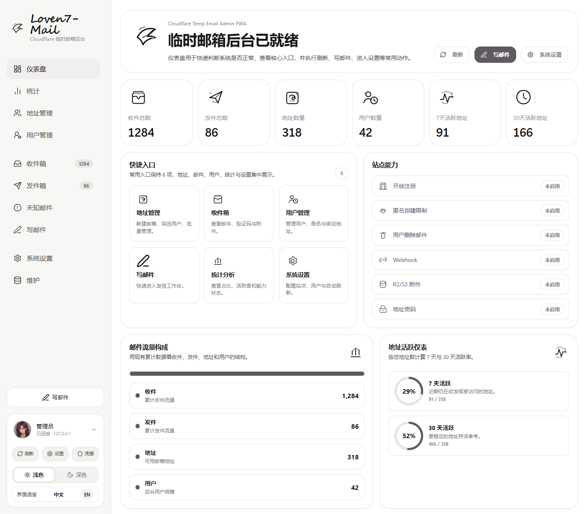
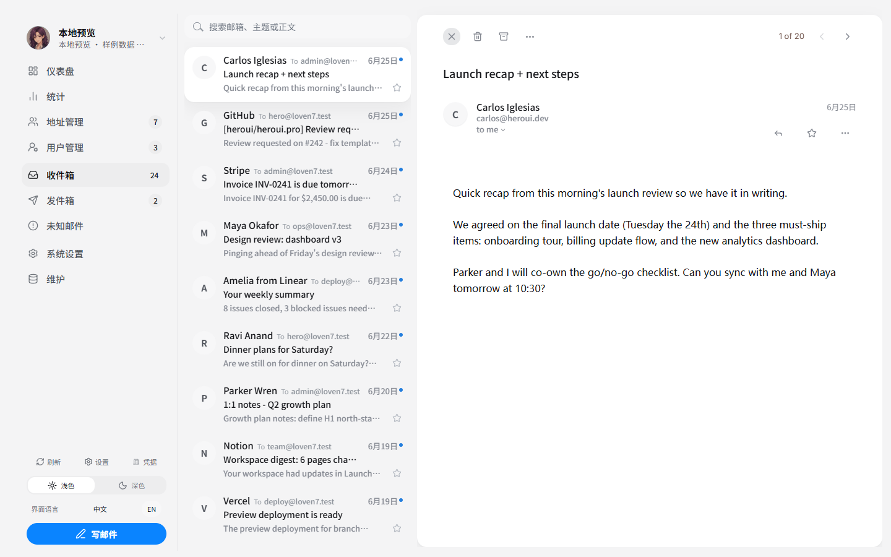
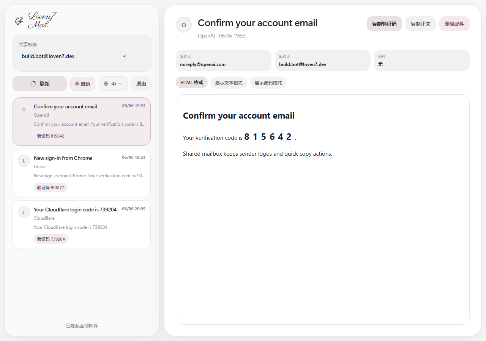
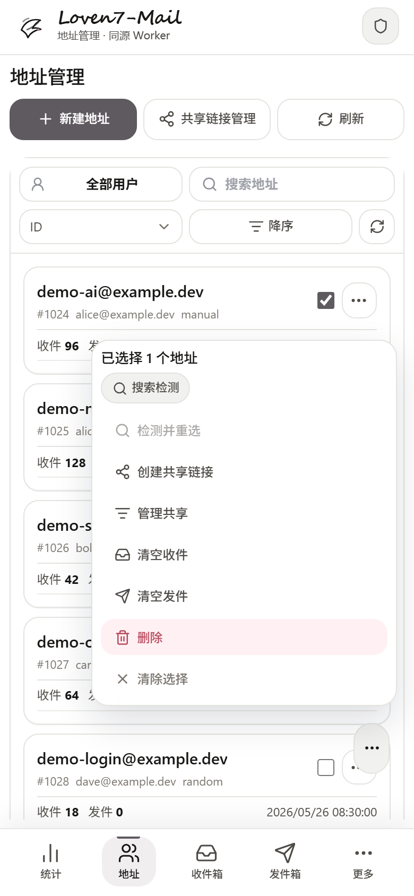

<div align="center">


# Loven7 Mail Cloudflare Suite

**一套接入 Cloudflare Temp Mail / `cloudflare_temp_email` 的现代化邮箱前端。**<br />
管理后台、用户邮箱站、单邮箱分享、多邮箱聚合分享、验证码识别和品牌头像都整理在一个仓库里。

<p>
  <a href="https://github.com/Lur1N77777/loven7-mail-cloudflare-suite/blob/main/LICENSE"></a>
  
  
  
  
</p>

<p>
  <a href="https://github.com/Lur1N77777/loven7-mail-cloudflare-suite/actions/workflows/ci.yml"></a>
  <a href="https://github.com/Lur1N77777/loven7-mail-cloudflare-suite/actions/workflows/deploy-cloudflare-pages.yml"></a>
</p>

<p>
  <a href="#-1-分钟最快部署复制这一段给-ai-agent">AI Agent 部署</a>
  ·
  <a href="#-界面预览">界面预览</a>
  ·
  <a href="#-这个项目是什么">项目介绍</a>
  ·
  <a href="#-手动部署教程">手动部署</a>
  ·
  <a href="#-自动构建和自动部署">自动部署</a>
  ·
  <a href="#-常见问题">常见问题</a>
</p>

</div>

> 本仓库不包含上游 Worker 后端源码，不内置私人 API、密码、Token、KV ID 或个人域名。部署后在网页界面里填写你自己的 Worker API 和管理员密码即可。

---

## 🚀 1 分钟最快部署：复制这一段给 AI Agent

如果你使用 Claude Code、Codex、OpenCode、Hermes、OpenClaw 或其他 AI 编程 / 运维 Agent，直接复制下面这一段话即可。**不要把 API、密码、Token 或密钥写进 Prompt。**

```text
请帮我部署这个 GitHub 项目到我的 Cloudflare 账号：https://github.com/Lur1N77777/loven7-mail-cloudflare-suite 。这是基于 Cloudflare Temp Mail / cloudflare_temp_email 官方 Worker API 的增强前端套件，包含 apps/admin 管理后台和 apps/webmail 用户站/分享站。请创建两个 Cloudflare Pages 项目：管理后台使用 apps/admin，构建命令 npm ci && npm run build，输出目录 dist；用户站使用 apps/webmail，构建命令 npm ci && npm run build，输出目录 dist。不要让我在这段 Prompt 里填写任何 API、密码、Token 或密钥，也不要把这些信息写入仓库；管理后台部署完成后，我会在网页界面的“连接设置”里填写自己的 Worker API 地址和管理员密码。分享功能如果需要 KV 或运行时变量，请通过 Cloudflare 控制台/安全配置完成，并生成必要密钥，但不要在最终回复中泄露密钥原文。部署完成后请返回管理后台 URL、用户站 URL，以及我下一步需要在界面里完成的配置。
```

更完整的 AI Agent 专用部署文档在：[`docs/AGENT_DEPLOY_PROMPT.md`](docs/AGENT_DEPLOY_PROMPT.md)。

---

## ✨ 界面预览

下面的图片是本地运行实际前端后截取的界面截图，使用脱敏 mock 数据，不包含真实 API、邮箱、Token、密码或个人域名。

展示规则：桌面端截图统一使用同一缩略高度，手机端截图使用同高度但自然窄一些；点击任意图片可以查看原始大图。这样能保持整体版面协调，同时保证图和图注都看得清。

<table>
  <tr>
    <td width="50%" valign="top" align="center">
      <a href="docs/screenshots/admin-dashboard.png">
        
      </a>
      <br />
      <sub><strong>管理后台 · 仪表盘</strong><br />统计卡片、快捷入口和站点能力状态。</sub>
    </td>
    <td width="50%" valign="top" align="center">
      <a href="docs/screenshots/admin-inbox.png">
        
      </a>
      <br />
      <sub><strong>管理后台 · 收件箱</strong><br />品牌头像、验证码识别和邮件阅读区。</sub>
    </td>
  </tr>
  <tr>
    <td width="50%" valign="top" align="center">
      <a href="docs/screenshots/webmail-share.png">
        
      </a>
      <br />
      <sub><strong>用户站 / 分享站</strong><br />自动刷新、共享收件箱和验证码快捷复制。</sub>
    </td>
    <td width="50%" valign="top" align="center">
      <a href="docs/screenshots/mobile-address-actions.png">
        
      </a>
      <br />
      <sub><strong>手机端 · 地址管理</strong><br />紧凑列表、三点菜单和批量浮动操作。</sub>
    </td>
  </tr>
</table>

---

## 💡 这个项目是什么

Loven7 Mail Cloudflare Suite 是一套给 Cloudflare Temp Mail / `cloudflare_temp_email` 使用的增强前端。它不替代你的上游 Worker，而是把后台管理、用户登录、邮箱分享和邮件阅读体验整理成更现代的 Cloudflare Pages 前端。

<table>
  <tr>
    <td width="50%" valign="top">
      <strong>apps/admin · 管理员后台 PWA</strong>
      <br /><br />
      管理邮箱地址、用户、收件箱、未知邮件、发件箱、共享链接、系统设置和维护工具。
    </td>
    <td width="50%" valign="top">
      <strong>apps/webmail · 用户邮箱站 / 分享站</strong>
      <br /><br />
      支持单邮箱 JWT 登录、单邮箱分享、多邮箱分享、聚合分享页和访客侧邮件隐藏。
    </td>
  </tr>
</table>

你可以把它接到自己已经部署好的 Cloudflare Temp Mail 官方 Worker 上，用自己的 Cloudflare 账号、自己的域名、自己的邮箱系统运行。

---

## 🌟 核心能力

| 模块 | 能力 |
| --- | --- |
| 邮件管理 | 收件箱、未知邮件、发件箱、实时搜索、移动端无限加载、HTML 邮件渲染、管理端连续邮件堆叠 |
| 验证码 | 多语言验证码识别、候选码快捷复制、堆叠邮件内验证码复制 |
| 地址管理 | 批量选择、按用户筛选、地址搜索、批量检测、三点菜单、移动端浮动操作 |
| 分享链接 | 单邮箱分享、多邮箱分享、聚合分享、仅新增邮件分享、撤回/恢复、实时搜索、有效/失效筛选 |
| 用户站 | JWT 登录、分享访问、自动刷新圆环、访客侧显示“删除邮件”（实际仅隐藏共享视图，不影响后台） |
| 视觉体验 | 品牌头像、柔和浅/深色模式、中英切换、PWA、移动端手势和轻量动效 |

---

## 🧱 技术栈

<table>
  <tr>
    <td><strong>Frontend</strong></td>
    <td>React 19, TypeScript, Vite, Tailwind CSS, Lucide Icons</td>
  </tr>
  <tr>
    <td><strong>Runtime</strong></td>
    <td>Cloudflare Pages, Pages Functions, KV Namespace</td>
  </tr>
  <tr>
    <td><strong>Mail</strong></td>
    <td>Cloudflare Temp Mail / <code>cloudflare_temp_email</code> compatible Worker API, Postal MIME</td>
  </tr>
  <tr>
    <td><strong>App UX</strong></td>
    <td>PWA, local credential cache, responsive layout, mobile action menus, auto refresh</td>
  </tr>
</table>

---

## 📁 项目结构

```text
apps/admin       管理员后台 PWA
apps/webmail     用户邮箱站 / 分享站，包含 Cloudflare Pages Functions
docs/            部署文档、AI Agent Prompt、截图和安全说明
scripts/         发布、检查和辅助脚本
```

---

## 🛠 手动部署教程

### 部署前准备

你需要先准备：

| 名称 | 示例 | 说明 |
| --- | --- | --- |
| Cloudflare Temp Mail Worker/API | `https://your-worker.workers.dev` | 你自己的上游 Worker/API 地址 |
| 管理员密码 | 不要写进仓库 | 上游 Worker 的 `x-admin-auth` 管理密码 |
| 站点密码 | 可选 | 如果上游 Worker 配置了 `x-custom-auth` 才需要 |
| Cloudflare KV | `SHARE_KV` | 分享链接功能需要 |
| 分享加密密钥 | 32 字符以上随机字符串 | 用户站环境变量 `SHARE_ENCRYPTION_SECRET` |

如果你还没有部署上游后端，请先部署 Cloudflare Temp Mail / `cloudflare_temp_email` 官方 Worker。

部署前建议先在仓库根目录运行一次本地预检：

```bash
npm run check:cloudflare
```

这个命令只检查 Cloudflare Pages 项目名、GitHub Actions、Webmail Pages Functions 检查脚本、运行时变量文档和 KV 绑定说明是否一致；不会连接 Cloudflare、不会部署，也不会读取或输出任何真实密钥。

### 第 1 步：部署管理后台

在 Cloudflare Pages 新建项目，连接本 GitHub 仓库。

管理后台 Pages 设置：

| 设置项 | 值 |
| --- | --- |
| Project name | `loven7-mail-admin`，也可以自定义 |
| Root directory | `apps/admin` |
| Build command | `npm ci && npm run build` |
| Output directory | `dist` |

环境变量可以先不填。

部署完成后打开管理后台，在“连接设置”里填写：

- Worker API 地址
- 管理员密码
- 站点密码（如果有）

这些信息会保存在当前浏览器本地缓存里，不会提交到 GitHub。

可选环境变量：

| 变量 | 是否必填 | 说明 |
| --- | --- | --- |
| `VITE_API_BASE` | 否 | 默认 Worker API 地址。公开部署建议留空，让用户在浏览器里填写。 |
| `VITE_FRONTEND_LOGIN_BASE` | 否 | 用户站 URL。也可以部署后在后台“系统设置”里保存。 |
| `VITE_APP_NAME` | 否 | 显示名称，默认 `Loven7-Mail`。 |

### 第 2 步：部署用户站 / 分享站

在 Cloudflare Pages 再新建一个项目，仍然连接本 GitHub 仓库。

用户站 Pages 设置：

| 设置项 | 值 |
| --- | --- |
| Project name | `loven7-mail-webmail`，也可以自定义 |
| Root directory | `apps/webmail` |
| Build command | `npm ci && npm run build` |
| Output directory | `dist` |

用户站必须设置运行时环境变量：

| 变量 | 是否必填 | 说明 |
| --- | --- | --- |
| `MAIL_WORKER_BASE_URL` | 必填 | 你的 Cloudflare Temp Mail Worker/API 地址 |
| `SITE_PASSWORD` | 可选 | 如果上游 Worker 开启了站点密码就填写 |
| `SHARE_ENCRYPTION_SECRET` | 使用分享功能时必填 | 用于加密分享记录，建议 32 字符以上随机字符串 |
| `SHARE_ADMIN_CORS_ORIGINS` | 分站管理分享时必填 | 管理后台页面的完整 origin，例如 `https://your-admin.pages.dev`；多个用逗号分隔 |
| `SHARE_PUBLIC_CORS_ORIGINS` | 可选 | 公开分享 API 的额外跨源来源；默认留空，只允许同源分享页调用 |

如果管理后台和用户站是两个 Cloudflare Pages 项目，必须在**用户站** Pages 运行时变量里设置 `SHARE_ADMIN_CORS_ORIGINS=<管理后台 origin>`，否则后台创建/管理分享链接会被浏览器 CORS 拦截。不要设置 `*`。

如果你复用已有 Cloudflare Pages 项目，部署前请显式设置：

```powershell
$env:ADMIN_PAGES_PROJECT_NAME="你的管理后台 Pages 项目名"
$env:WEBMAIL_PAGES_PROJECT_NAME="你的用户站 Pages 项目名"
```

如果部署到 `preview` 分支，Cloudflare Pages 的 Preview 环境需要单独配置运行时变量、secret 和 KV 绑定；Production 已配置不代表 Preview 自动可用。确认 Preview 已配置 `MAIL_WORKER_BASE_URL`、可选 `SITE_PASSWORD`、`SHARE_ENCRYPTION_SECRET`、`SHARE_ADMIN_CORS_ORIGINS` 和 `SHARE_KV` 后，可以设置 `WEBMAIL_PREVIEW_RUNTIME_CONFIRMED=1` 再运行预检。完整清单见 [`docs/CLOUDFLARE_PAGES.md`](docs/CLOUDFLARE_PAGES.md)。

部署后可以运行线上 runtime 探针。新版用户站会先读取只读诊断接口 `/api/runtime`，只返回配置项是否存在、缺失项和修复提示；不会输出 `MAIL_WORKER_BASE_URL`、`SITE_PASSWORD`、`SHARE_ENCRYPTION_SECRET`、KV ID 或任何 secret 原文。若线上版本还没包含 `/api/runtime`，脚本会退回到无效分享 token 和假账号探针：

```powershell
$env:WEBMAIL_RUNTIME_URL="https://你的用户站-preview域名"
npm run check:cloudflare:runtime
```

探针会确认页面可访问、`/api/runtime` 是否报告 Preview/Production 运行时已补齐，并在必要时继续确认分享 runtime 是否已绑定 `SHARE_KV` / `SHARE_ENCRYPTION_SECRET`，以及邮箱 API runtime 是否已配置 `MAIL_WORKER_BASE_URL`。

分享功能还需要绑定 Cloudflare KV：

| Binding name | 类型 | 说明 |
| --- | --- | --- |
| `SHARE_KV` | KV Namespace | 保存分享链接、撤回状态、仅新增邮件 cutoff 和隐藏邮件记录 |

如果你只需要单邮箱 JWT 登录，不使用分享功能，可以暂时不绑定 KV；但管理后台里的分享创建和分享管理会不可用。

### 第 3 步：把管理后台连接到用户站

两个 Pages 项目都部署好以后：

1. 打开管理后台。
2. 进入“系统设置”。
3. 找到“前端登录链接前缀”。
4. 填入用户站 URL，例如：

```text
https://your-webmail.pages.dev
```

5. 保存。
6. 回到“地址管理”，选择一个邮箱，复制登录链接测试。
7. 再选择一个或多个邮箱创建分享链接，确认用户站能打开。

---

## ⚙️ 自动构建和自动部署

仓库已经内置 GitHub Actions：

| Workflow | 触发方式 | 作用 |
| --- | --- | --- |
| `Build & Validate` | PR、push 到 `main`、手动运行 | 安装依赖、检查管理后台 TypeScript、构建管理后台和用户站 |
| `Deploy to Cloudflare Pages` | push 到 `main`、手动运行 | 构建两个站点；配置 Cloudflare 后自动部署到 Pages |

默认不会把任何 API、密码或 Token 写进代码。要开启自动部署，只需要在 GitHub 仓库里配置：

**Secrets**

```text
CLOUDFLARE_API_TOKEN
CLOUDFLARE_ACCOUNT_ID
```

**Variables**

```text
ADMIN_PAGES_PROJECT_NAME
WEBMAIL_PAGES_PROJECT_NAME
```

用户站的 `MAIL_WORKER_BASE_URL`、`SITE_PASSWORD`、`SHARE_ENCRYPTION_SECRET`、`SHARE_ADMIN_CORS_ORIGINS` 和 `SHARE_KV` 仍然建议在 Cloudflare Pages 项目设置里配置。详细步骤见 [`docs/GITHUB_ACTIONS.md`](docs/GITHUB_ACTIONS.md)。

如果你想让 AI Agent 代你配置这套自动部署流程，可以把下面这段话复制给 Agent。不要把 Cloudflare Token、GitHub Token、管理员密码或 Worker API 密钥写进 Prompt，让 Agent 在需要时通过安全的 secrets/variables 输入流程读取。

```text
请帮我为这个 GitHub 仓库配置 GitHub Actions 自动部署流程：https://github.com/Lur1N77777/loven7-mail-cloudflare-suite 。仓库里已经有 .github/workflows/ci.yml 和 .github/workflows/deploy-cloudflare-pages.yml。请先检查两个 workflow 是否存在并解释它们会做什么，然后在 GitHub 仓库的 Actions secrets/variables 中配置自动部署需要的 CLOUDFLARE_API_TOKEN、CLOUDFLARE_ACCOUNT_ID、ADMIN_PAGES_PROJECT_NAME、WEBMAIL_PAGES_PROJECT_NAME。不要把任何 Token、密码、Worker API、KV ID 或个人域名写进代码、README、commit 或日志。配置完成后，请手动触发一次 Deploy to Cloudflare Pages workflow，确认管理后台 apps/admin 和用户站 apps/webmail 都构建成功；如果 Cloudflare Pages 项目不存在，请指导我先创建两个 Pages 项目或用 Cloudflare 控制台创建。最后返回 Actions 运行结果、两个 Pages 项目名、以及我还需要在 Cloudflare Pages 里配置的用户站运行时变量 MAIL_WORKER_BASE_URL、SITE_PASSWORD、SHARE_ENCRYPTION_SECRET、SHARE_ADMIN_CORS_ORIGINS 和 SHARE_KV。
```

---

## 💻 本地开发

```bash
# 管理后台
cd apps/admin
npm ci
npm run dev

# 用户站
cd ../webmail
npm ci
npm run dev
```

本地预览用户站 Pages Functions：

```bash
cd apps/webmail
npm run build
npx wrangler pages dev dist \
  --compatibility-date=2026-05-11 \
  --binding MAIL_WORKER_BASE_URL=https://your-worker.example.workers.dev \
  --binding SHARE_ENCRYPTION_SECRET=replace-with-a-long-random-secret \
  --binding SHARE_ADMIN_CORS_ORIGINS=http://localhost:5173
```

---

## 🧭 相关文档

| 文档 | 用途 |
| --- | --- |
| [`docs/AGENT_DEPLOY_PROMPT.md`](docs/AGENT_DEPLOY_PROMPT.md) | 给 AI Agent 的完整部署说明 |
| [`docs/CLOUDFLARE_PAGES.md`](docs/CLOUDFLARE_PAGES.md) | Cloudflare Pages 部署细节 |
| [`docs/GITHUB_ACTIONS.md`](docs/GITHUB_ACTIONS.md) | GitHub Actions 自动构建与自动部署 |
| [`docs/ENGINEER_HANDOFF.md`](docs/ENGINEER_HANDOFF.md) | 给接手工程师的项目结构和模块说明 |
| [`docs/SECURITY_DESENSITIZATION.md`](docs/SECURITY_DESENSITIZATION.md) | 脱敏和安全检查说明 |
| [`docs/UPSTREAM.md`](docs/UPSTREAM.md) | 上游项目关系说明 |

---

## ❓ 常见问题

### 后台刷新后又要求输入密码

请固定使用同一个正式域名访问后台。浏览器缓存按域名隔离，如果你每次打开不同的 Cloudflare Pages 预览域名，缓存不会共享。

### 用户站打不开邮件

检查 `MAIL_WORKER_BASE_URL` 是否填的是 Cloudflare Temp Mail Worker/API 地址，不要填管理后台 Pages URL。

### 分享功能提示 `SHARE_KV is not configured`

用户站 Pages 没有绑定 KV Namespace。请到 Cloudflare Pages 的 Functions / Bindings 里绑定 `SHARE_KV`。

如果只有 Preview 报错，请切换到 Webmail Pages 项目的 Preview 环境绑定 `SHARE_KV`，并重新部署 Preview 分支；Production 的 KV 绑定不会自动应用到 Preview。

### Preview 邮件接口提示“邮箱 API 未配置”

检查 Webmail Pages 项目的 Preview 环境是否单独设置了 `MAIL_WORKER_BASE_URL`。如果上游 Worker 开启了站点密码，也要单独设置 Preview `SITE_PASSWORD`。修改后需要重新部署 Preview 分支。

也可以直接打开或探测用户站的 `/api/runtime`。如果 `missing` 包含 `MAIL_WORKER_BASE_URL`，说明当前部署环境还没拿到邮箱 Worker 地址；如果只在 Preview 出现，优先检查 Cloudflare Pages 的 Preview variables/secrets，而不是 Production。

### 分享功能提示 `SHARE_ENCRYPTION_SECRET is not configured`

用户站 Pages 没有设置分享加密密钥。添加 `SHARE_ENCRYPTION_SECRET` 后重新部署。

### 后台创建/管理分享链接提示网络或 CORS 失败

确认“系统设置 → 前端登录链接前缀”填写的是用户站 URL；然后在**用户站** Cloudflare Pages 运行时变量里设置 `SHARE_ADMIN_CORS_ORIGINS=<管理后台 origin>`，例如 `https://your-admin.pages.dev`。同时确认 `SHARE_KV` 和 `SHARE_ENCRYPTION_SECRET` 已配置。

---

## 🔒 安全说明

- 不要把 Worker API 密钥、管理员密码、站点密码、GitHub Token、Cloudflare Token 写进仓库。
- 管理后台的连接信息默认保存在浏览器本地。
- 用户站的 `SITE_PASSWORD` 和 `SHARE_ENCRYPTION_SECRET` 只应作为 Cloudflare Pages 运行时环境变量保存；`SHARE_ADMIN_CORS_ORIGINS` 只填写可信管理后台 origin，不要使用 `*`。
- 本仓库不应包含 `node_modules/`、`dist/`、`.env.production`、`.wrangler/` 等本地或私有产物。

---

## 📜 上游与许可证

本项目是 Cloudflare Temp Mail / `cloudflare_temp_email` 的增强前端套件。后端 Worker 请遵循上游项目的许可证和部署文档。

本仓库新增的前端代码按 MIT License 开源。
