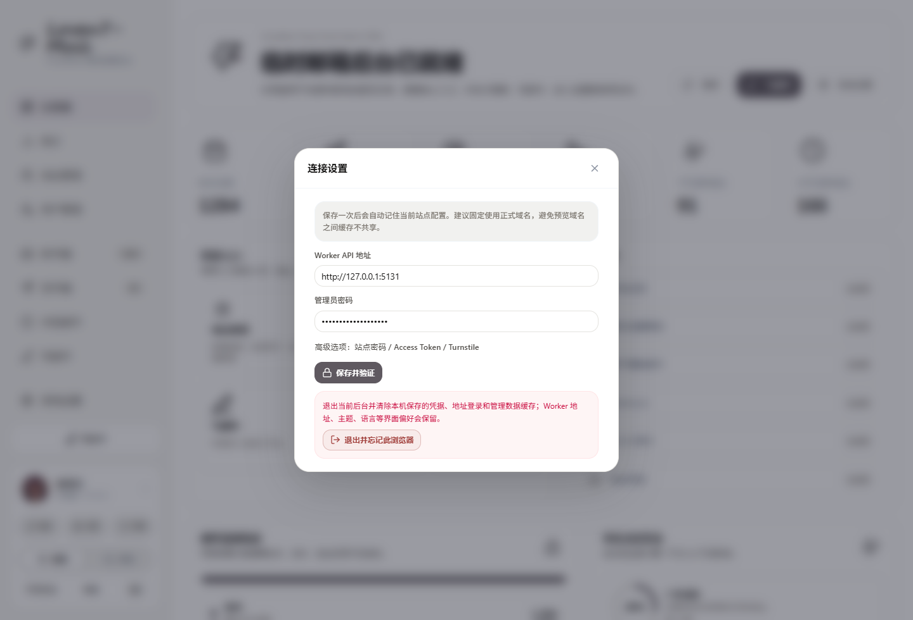
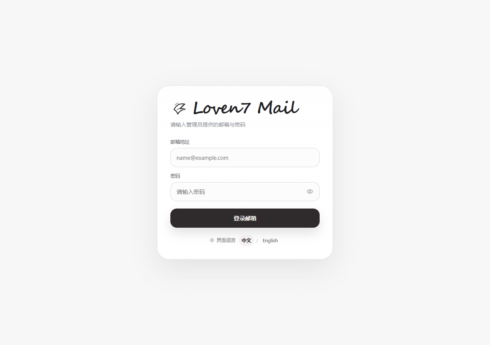

<div align="center">


# Loven7 Mail Cloudflare Suite

接入 Cloudflare Temp Mail / `cloudflare_temp_email` 的现代化前端套件。

管理后台、用户邮箱站、分享链接、验证码识别、移动端体验和 PWA 都整理在一个仓库里。

<p>
  <a href="https://github.com/Lur1N77777/loven7-mail-cloudflare-suite/blob/main/LICENSE"></a>
  
  
  
  <a href="https://github.com/Lur1N77777/loven7-mail-cloudflare-suite/actions/workflows/ci.yml"></a>
</p>

<p>
  <a href="#快速开始">快速开始</a>
  ·
  <a href="#界面预览">界面预览</a>
  ·
  <a href="#手动部署">手动部署</a>
  ·
  <a href="#文档">文档</a>
</p>

</div>

> 本仓库不包含上游 Worker 后端源码，不内置私人 API、密码、Token、KV ID 或个人域名。部署后在网页界面里填写自己的连接信息即可。

## 它是什么

Loven7 Mail Cloudflare Suite 是给 Cloudflare Temp Mail / `cloudflare_temp_email` 用的增强前端，不替代上游 Worker。

| 应用 | 用途 |
| --- | --- |
| `apps/admin` | 管理邮箱地址、用户、收件箱、未知邮件、发件箱、分享链接和系统设置 |
| `apps/webmail` | 用户邮箱站 / 分享站，支持 JWT 登录、单邮箱分享、多邮箱聚合分享 |

## 主要能力

- 管理后台：邮箱地址、用户、邮件、发件箱、分享链接和维护工具。
- 用户站：单邮箱登录、分享访问、自动刷新、验证码快捷复制。
- 分享：单邮箱、多邮箱、聚合分享、仅新增邮件、撤回/恢复、访客隐藏邮件。
- 体验：中英切换、浅/深色模式、PWA、移动端操作菜单、品牌头像。
- 部署：Cloudflare Pages + Pages Functions + KV Namespace。

## 快速开始

如果你已经有 Cloudflare Temp Mail / `cloudflare_temp_email` 上游 Worker，可以直接让 AI Agent 自动部署。

```text
请帮我自动部署这个 GitHub 项目到我的 Cloudflare 账号：https://github.com/Lur1N77777/loven7-mail-cloudflare-suite 。我已经有 Cloudflare Temp Mail / cloudflare_temp_email 上游 Worker。请创建两个 Cloudflare Pages 项目：管理后台使用 apps/admin，构建命令 npm ci && npm run build，输出目录 dist；用户站使用 apps/webmail，构建命令 npm ci && npm run build，输出目录 dist。不要让我在公开 Prompt 里填写 Cloudflare Token、GitHub Token、管理员密码、站点密码、Worker API 地址或分享密钥；如需这些值，请通过安全输入、secrets、Cloudflare 登录或 MCP 流程收集，不要写进仓库、README、commit、Actions 日志或最终回复。用户站请配置 MAIL_WORKER_BASE_URL、可选 SITE_PASSWORD、生成并保存 SHARE_ENCRYPTION_SECRET，创建或复用 Cloudflare KV Namespace 并绑定为 SHARE_KV；管理后台和用户站分开部署时，在用户站设置 SHARE_ADMIN_CORS_ORIGINS=<管理后台 origin>。部署后请检查用户站 /api/runtime，并返回管理后台 URL、用户站 URL、部署结果，以及我下一步需要在管理后台网页里完成的配置。
```

更短的部署说明见 [部署速查](docs/DEPLOYMENT_QUICKSTART.md)，完整 Agent 指令见 [AI Agent 部署指令](docs/AGENT_DEPLOY_PROMPT.md)。

> Cloudflare 官方 `Deploy to Cloudflare` 按钮目前只支持 Workers，不支持本仓库的双 Pages 项目部署；建议先用上面的 Agent 指令或按下面步骤手动部署。

## 界面预览

点击图片可以查看大图。

<table>
  <tr>
    <td width="50%" align="center">
      <a href="docs/screenshots/admin-dashboard.png"></a>
      <br /><strong>管理后台 · 运营总览</strong>
      <br /><sub>统计、快捷入口、能力覆盖和下一步操作集中展示。</sub>
    </td>
    <td width="50%" align="center">
      <a href="docs/screenshots/admin-connection-settings.png"></a>
      <br /><strong>连接设置 · 本地保存</strong>
      <br /><sub>Worker API、管理员密码和站点密码只保存在当前浏览器。</sub>
    </td>
  </tr>
  <tr>
    <td width="50%" align="center">
      <a href="docs/screenshots/admin-inbox.png"></a>
      <br /><strong>管理后台 · 邮件工作台</strong>
      <br /><sub>发件人品牌头像、验证码和正文统一展示，收件处理更直观。</sub>
    </td>
    <td width="50%" align="center">
      <a href="docs/screenshots/mobile-address-actions.png"></a>
      <br /><strong>移动端 · 地址操作</strong>
      <br /><sub>手机上也能复制、筛选、打开登录链接和分享动作。</sub>
    </td>
  </tr>
  <tr>
    <td width="50%" align="center">
      <a href="docs/screenshots/webmail-login.png"></a>
      <br /><strong>用户站 · 登录入口</strong>
      <br /><sub>邮箱地址和密码登录，支持中英切换，适合直接交给用户。</sub>
    </td>
    <td width="50%" align="center">
      <a href="docs/screenshots/webmail-share.png"></a>
      <br /><strong>用户站 · 分享访问</strong>
      <br /><sub>分享链接可聚合多个邮箱，保留品牌头像、验证码复制和自动刷新。</sub>
    </td>
  </tr>
</table>

## 手动部署

创建两个 Cloudflare Pages 项目：

| 站点 | Root directory | Build command | Output |
| --- | --- | --- | --- |
| 管理后台 | `apps/admin` | `npm ci && npm run build` | `dist` |
| 用户站 / 分享站 | `apps/webmail` | `npm ci && npm run build` | `dist` |

用户站运行时配置：

| 配置 | 说明 |
| --- | --- |
| `MAIL_WORKER_BASE_URL` | 上游 Temp Mail Worker/API 根地址 |
| `SITE_PASSWORD` | 可选，上游 Worker 开启站点密码时填写 |
| `SHARE_ENCRYPTION_SECRET` | 分享功能需要，建议 32 字符以上随机字符串 |
| `SHARE_ADMIN_CORS_ORIGINS` | 管理后台 origin，例如 `https://your-admin.pages.dev` |
| `SHARE_PUBLIC_CORS_ORIGINS` | 可选，默认留空 |
| `SHARE_KV` | KV Namespace 绑定名，分享功能唯一需要的数据库能力 |

数据库部分只有 Cloudflare KV：不需要 SQL、不需要 D1、不需要迁移。Preview / Production 环境的变量、secret 和 KV 绑定彼此独立；部署 Preview 前确认后再设置 `WEBMAIL_PREVIEW_RUNTIME_CONFIRMED=1`。

如果复用已有 Pages 项目，可以设置：

```powershell
$env:ADMIN_PAGES_PROJECT_NAME="你的管理后台 Pages 项目名"
$env:WEBMAIL_PAGES_PROJECT_NAME="你的用户站 Pages 项目名"
```

部署后：

1. 打开管理后台。
2. 在“连接设置”填写 Worker API 地址、管理员密码和可选站点密码。
3. 在“系统设置”把“前端登录链接前缀”设置为用户站 URL。
4. 到“地址管理”测试登录链接和分享链接。

## 检查命令

```bash
npm run check:cloudflare
npm run check:release
```

部署后检查用户站运行时：

```powershell
$env:WEBMAIL_RUNTIME_URL="https://你的用户站域名"
npm run check:cloudflare:runtime
```

用户站也提供只读诊断接口 `/api/runtime`，只返回配置是否存在和修复提示，不输出密钥原文。

## 文档

| 文档 | 用途 |
| --- | --- |
| [部署速查](docs/DEPLOYMENT_QUICKSTART.md) | 自动部署和手动部署最短路径 |
| [AI Agent 部署指令](docs/AGENT_DEPLOY_PROMPT.md) | 给 Claude Code、Codex、OpenCode 等 Agent 的完整指令 |
| [Cloudflare Pages 部署说明](docs/CLOUDFLARE_PAGES.md) | Pages、Preview / Production、KV 和 runtime 排错 |
| [GitHub Actions](docs/GITHUB_ACTIONS.md) | 自动构建和自动部署配置 |
| [安全脱敏检查](docs/SECURITY_DESENSITIZATION.md) | 发布前避免泄露密钥、Token、KV ID |
| [上游关系](docs/UPSTREAM.md) | 与 Cloudflare Temp Mail / `cloudflare_temp_email` 的关系 |

## 开源

MIT License。欢迎 Issue、PR 和部署反馈。提交前请先看 [CONTRIBUTING.md](CONTRIBUTING.md) 和 [SECURITY.md](SECURITY.md)。
